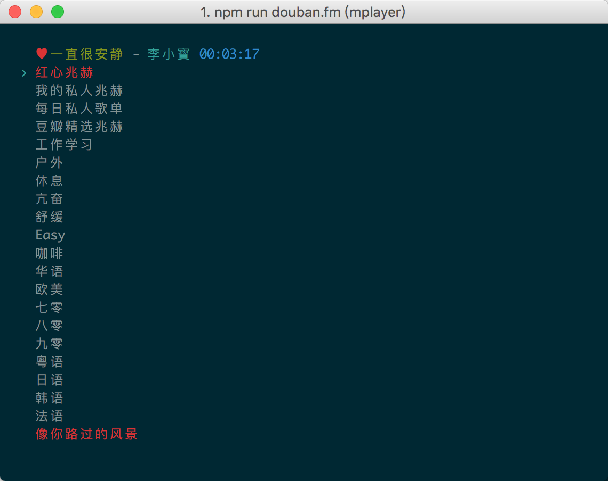

## douban.fm
* 简洁的豆瓣电台命令行版，基于 Node.js。

## 截屏

## 功能特性
* 支持登录
* 支持同步收听记录
* 支持播放红心兆赫
* 支持标红心，取消红心
* 支持歌词显示

## 依赖
* Node.js 7.x
* mplayer

## 安装
* npm i doubanfm -g

## 命令行启动
* doubanfm

## 快捷键
* j 光标下移
* k 光标上移
* enter/return(回车) 切换到当前选择兆赫
* n 切歌，播放下一首
* r 标红心
* u 取消红心
* space(空格) 切换播放及暂停状态

## Thanks
* https://github.com/guo-yu/douban.fm
* https://github.com/taizilongxu/douban.fm
* https://github.com/ted423/lrc-parser